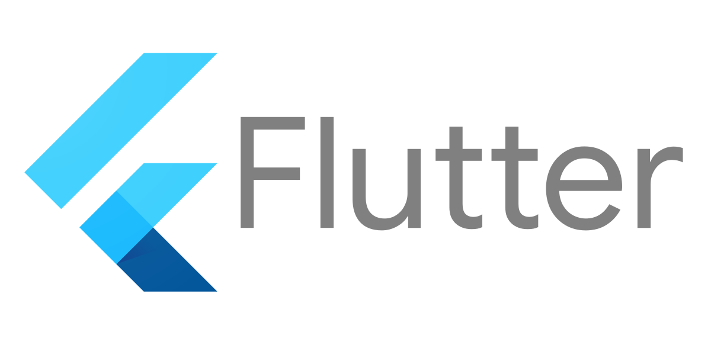
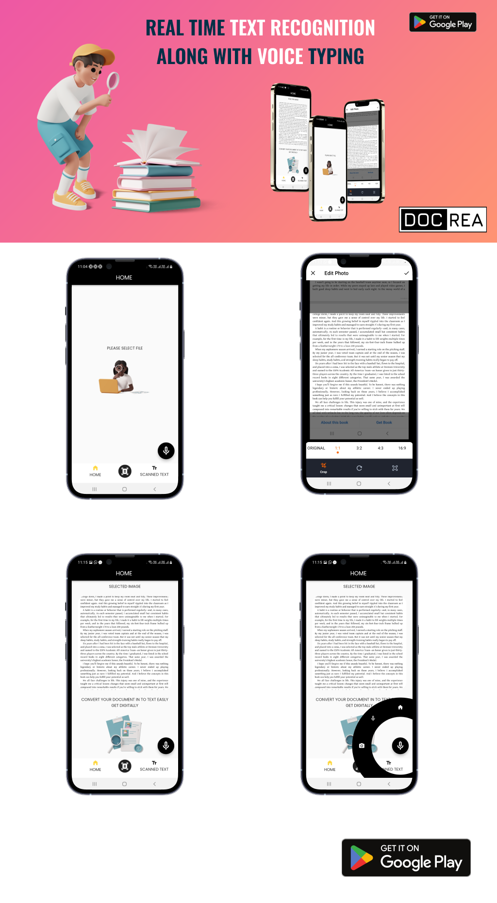

<!--
Hey, thanks for using the awesome-readme-template template.  
If you have any enhancements, then fork this project and create a pull request 
or just open an issue with the label "enhancement".

Don't forget to give this project a star for additional support ;)
Maybe you can mention me or this repo in the acknowledgements too
-->

  
  <h1>DOCREA OCR TEXT READER AND VOICE RECOGNITION</h1>
  
  

   AN OCR READER WITH VOICE TYPING
  

  
  
<!-- Badges -->

 

 

<!-- Table of Contents -->
# DOCREA FUNCTIONALITIES

- ## PACKAGES USED
  - Getx
  - Google ML Kit
  - Image Picker
  - Image Cropper
  - Text To Speech
  - Bottomnav With Sheet
  - Clipboard
  - GetX
  - ACR Cloud (#Song identification api)
  - Share Plus
  - Curved Navigation Bar
  - Google Fonts
  - Slide To Confirm
  <!-- About the Project -->
    
 
  ## FUNCTIONALITIES
  - Scan Text Using Camera
  - Scan Text In Storage Files
  - Copy text
  - Voice Typing
  - Crop Images

 

  

<!-- About the Project -->
## :star2: About the Project

<!-- Screenshots -->
### :camera: Screenshots

 
  

